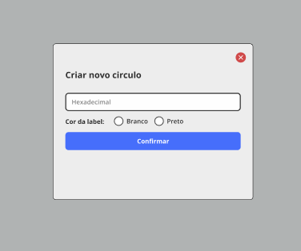

## 💻 Tecnologias 

Esse projeto foi desenvolvido com as seguintes tecnologias:

- HTML e CSS
- JavaScript
- Git e Github
- Figma

## 📘 projeto

esse desafio foi muito interessante, criar um campo modal onde o usuario poderá
escolher a cor "Hexadecimal" e a borda do circulo.

feito por 🙋‍♂️ Caio lima

