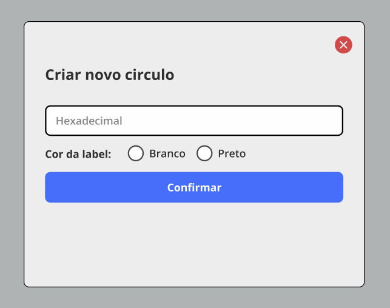

## 📘 projeto 

Esse desafio foi muito interessante, criar um campo modal onde o usuario poderá
escolher a cor "Hexadecimal" e a borda do circulo.

## tarefas do projeto 

1. Quando eu clicar no botão "+" abrir formulario

2. Quando eu clicar no botão "x" fechar formulario

3. Se o usuario não digitar nada dentro do campo o botão
deve ficar bloqueado.

4. Ao criar o circulo o formulario deve fechar.

5. Os circulos criados sempre no centro da tela.

6. Quando atingir 5 circulos criados o 6 deverar ir para linha de baixo.

## 💻 Tecnologias 

Esse projeto foi desenvolvido com as seguintes tecnologias:

- HTML e CSS
- JavaScript
- Git e Github
- Figma

                    feito por 🙋‍♂️ Caio lima 

